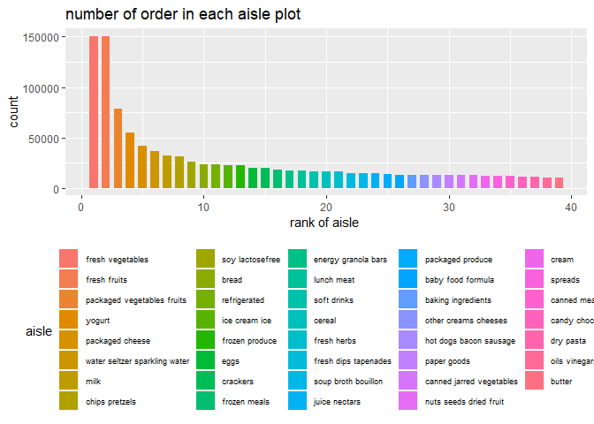
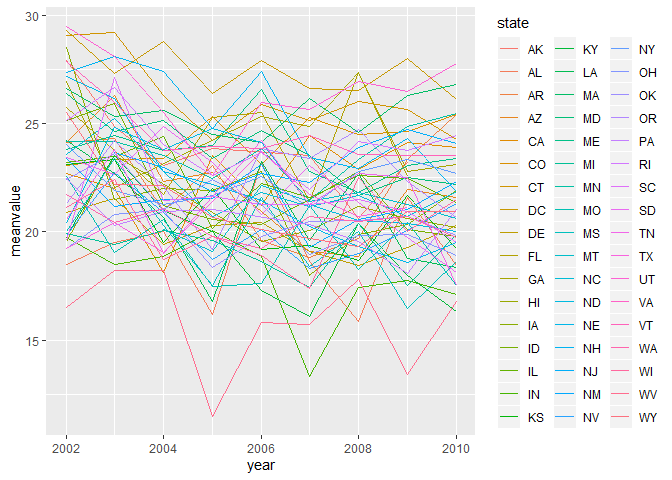
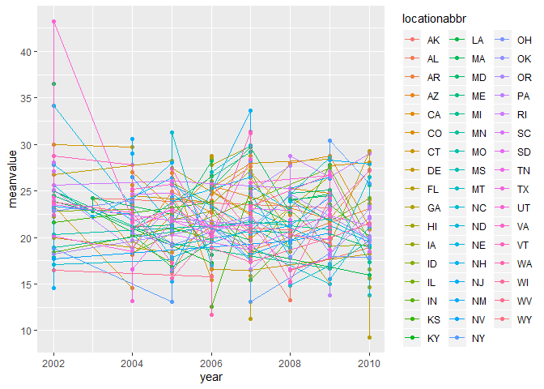

p8105\_hw3\_gx2144
================
Guangling Xu
10/4/2019

## set up

``` r
library(tidyverse)
library(p8105.datasets)
library(skimr)
data("instacart")
data("brfss_smart2010")
```

## Problem 1

  - Dataset Discription:

  - There are 15 variables and 1,384,617 columns for each
    variable.Meanings of each variable are listed below:
    
      - order\_id: order identifier, to identify different orders.
      - product\_id: product identifier, to identify different products
        in different aisles.
      - add\_to\_cart\_order: order in which each product was added to
        cart.
      - reordered: 1 if this prodcut has been ordered by this user in
        the past, 0 otherwise.
      - user\_id: customer identifier, to identify different users. In
        this dataset, there are 131,209 unique users.
      - eval\_set: data for use in this class is exclusively from the
        “train” eval\_set.
      - order\_number: the order sequence number for this user (1 =
        first, n = nth).
      - order\_dow: the day of the week on which the order was placed.
      - order\_hour\_of\_day: the hour of the day on which the order was
        placed.
      - days\_since\_prior\_order: days since the last order, capped at
        30, NA if it was the first time being orderd.
      - product\_name: name of the product.
      - aisle\_id: aisle identifier,identify different aisles.
      - department\_id: department identifier, identify different
        aisles.
      - aisle: the name of the aisle.
      - department: the name of the department.

  - Use the 1st row as an example.The first order user:112108 bought was
    Bulgarian yogurt from yogurt aisle(id = 120) of dairy eggs
    department(id = 16). This product has been reorderd after 9 days of
    its last order at the 4th day of the week,10 am. The product id is
    49302 and the order id is 1.

## Format data

``` r
instacart = instacart %>% 
  mutate(
    aisle = as.factor(aisle), 
    order_dow = recode(order_dow, 
                       "0" = "Sunday",
                       "1" = "Monday",
                       "2" = "Tuesday",
                       "3" = "Wedensday",
                       "4" = "Thursday",
                       "5" = "Friday",
                       "6" = "Saturday"),
    order_dow = as.factor(order_dow)
  
         )        
```

## Problem1

### count the aisle

``` r
aislename = instacart %>% 
  select("aisle") %>% 
  distinct()  
nrow(aislename)
```

    ## [1] 134

  - There are 134 aisles here.

<!-- end list -->

``` r
topaisle = instacart %>% 
  group_by(aisle) %>% 
  count( name = "count") %>% 
  arrange(desc(count)) %>% 
  head(n = 5L)  
knitr::kable(topaisle)
```

| aisle                      |  count |
| :------------------------- | -----: |
| fresh vegetables           | 150609 |
| fresh fruits               | 150473 |
| packaged vegetables fruits |  78493 |
| yogurt                     |  55240 |
| packaged cheese            |  41699 |

  - The Top 5 aisles are fresh vegetables, fresh fruits, packaged
    vegetables fruits, yogurt and packaged cheese.

### Number of items in each aisle

``` r
aislenumber = instacart %>% 
  count(aisle, name = "count") %>% 
  arrange(desc(count)) %>% 
  filter(count > 10000) %>% 
  mutate(
    rank = c(1:length(aisle)),
    aisle = fct_reorder(aisle , rank)
        ) 

ggplot(aislenumber,aes(x = rank,y = count, color = aisle))+
  geom_point()+
  labs(
    title = "number of order in each aisle plot",
    x = "rank of aisle ",
    y = "count of aisle"
  )+
  theme(
    legend.text = element_text( size = 7),
    legend.position = "bottom"
    )
```

<!-- -->

  - The aisle from which the items were ordered most is fresh
    vegetables.

### Three most popular items

``` r
popbaking = instacart %>% 
  filter(aisle == "baking ingredients") %>% 
  select(aisle,product_name) %>% 
  group_by(aisle,product_name) %>% 
  count(name = "count") %>% 
  arrange(desc(count)) 
popbaking = popbaking[c(1:3),]
  
popdogfood = instacart %>% 
  filter(aisle == "dog food care") %>% 
  select(aisle,product_name) %>% 
  group_by(aisle,product_name) %>% 
  count(name = "count") %>% 
  arrange(desc(count)) 
popdogfood = popdogfood[c(1:3),]

popveg = instacart %>% 
  filter(aisle == "packaged vegetables fruits") %>% 
  select(aisle,product_name) %>% 
  group_by(aisle,product_name) %>% 
  count(name = "count") %>% 
  arrange(desc(count)) 
popveg = popveg[c(1:3),]

pop1 = full_join(popbaking,popdogfood)
pop2 = full_join(pop1,popveg)
knitr::kable(pop2)
```

| aisle                      | product\_name                                 | count |
| :------------------------- | :-------------------------------------------- | ----: |
| baking ingredients         | Light Brown Sugar                             |   499 |
| baking ingredients         | Pure Baking Soda                              |   387 |
| baking ingredients         | Cane Sugar                                    |   336 |
| dog food care              | Snack Sticks Chicken & Rice Recipe Dog Treats |    30 |
| dog food care              | Organix Chicken & Brown Rice Recipe           |    28 |
| dog food care              | Small Dog Biscuits                            |    26 |
| packaged vegetables fruits | Organic Baby Spinach                          |  9784 |
| packaged vegetables fruits | Organic Raspberries                           |  5546 |
| packaged vegetables fruits | Organic Blueberries                           |  4966 |

  - Three most popular products of baking ingredients aisle are Light
    Brown Sugar, Pure Baking Soda and Cane Sugar whose counts are
    499,387 and 336.
  - Three most popular products of dog food care are Snack Sticks
    Chicken & Rice Recipe Dog Treats, Organix Chicken & Brown Rice
    Recipe and Small Dog Biscuits whose counts are 30,28 and 26.
  - Three most popular products of packaged vegetables fruits are
    Organic Baby Spinach, Organic Raspberries andOrganic Blueberriess
    whose counts are 9784,5546 and 4966.

### Apple and Ice Cream

``` r
meanhour = instacart %>% 
   filter(product_name ==  c("Pink Lady Apples","Coffee Ice Cream")) %>%
   group_by(product_name,order_dow) %>% 
   summarize(
     meanhour = round(mean(order_hour_of_day),digit =2)) %>% 
   pivot_wider(
    names_from = order_dow,
    values_from = meanhour
  ) 

knitr::kable(meanhour,digits = 0)
```

| product\_name    | Friday | Monday | Saturday | Sunday | Thursday | Tuesday | Wedensday |
| :--------------- | -----: | -----: | -------: | -----: | -------: | ------: | --------: |
| Coffee Ice Cream |     10 |     15 |       12 |     13 |       15 |      15 |        15 |
| Pink Lady Apples |     14 |     12 |       12 |     12 |       12 |      12 |        14 |

  - For Coffee Ice cream, mean hour of the day at which it has been
    ordered shows that on weekdays, it was ordered in the afternoon
    aroud 3pm.However, on the weekends, customers like to order around
    noon. Friday is unique because on that day, the mean hour when the
    products were ordered was around 10am.
  - For Pink Lady Apples, mean hour of the day at which it has been
    ordered shows that mostly, it was ordered around lunch time.

## Problem 2

### clean data

``` r
brfss_smart2010 = brfss_smart2010 %>% 
  janitor::clean_names() %>%
    separate(locationdesc, into = c("location" , "place"), sep = 4) %>% 
    select(year, locationabbr,  state = locationabbr, place, response_value = data_value, -location, response, topic) %>% 
  filter(topic == "Overall Health"& 
         response == c("Excellent","Very good","Fair","Good","Poor")) %>%
  mutate(
    response = factor(response, 
               levels = c("Excellent","Very good","Good","Fair","Poor"))
         ) 
```

    ## Warning in response == c("Excellent", "Very good", "Fair", "Good", "Poor"):
    ## longer object length is not a multiple of shorter object length

## States observed at 7 or more locations

``` r
states = brfss_smart2010 %>%
  select(year,state,place,response) %>% 
  filter(year == "2002"|year == "2010") %>%
  group_by(year,state) %>% 
  summarize(n = n_unique(place)) %>% 
  filter(n >= 7) %>% 
  arrange(n)
```

  - There are only one state which were observed at 7 or more locations
    in 2002 which is PA.

  - There are 7 state which were observed at 7 or more locations in
    2010.They were CA,WA,NC,NJ,MD,TX,FL.Compared to 2002,more states
    were observed and more locations were surveyed.And there were big
    differences between the choice of state where the survey was
    conducted.Changes between 2002 and 2010 reflect potential public
    health concerns given by the investigators.

<!-- end list -->

``` r
excellent = brfss_smart2010 %>%
  filter(response == "Excellent") %>% 
  select(year,state,response_value) %>% 
  group_by(year,state) %>% 
  summarise(meanvalue =round(mean(response_value),digit =2)) %>% 
  na.omit(meanvalue)  
  
ggplot(excellent,aes(x = year,y = meanvalue))+
    geom_line(aes(color = state)) + 
    theme(legend.position = "right")+       
    scale_y_continuous(breaks = seq(0,40,5))
```

<!-- -->

  - comment:

<!-- end list -->

``` r
NY = brfss_smart2010 %>%
  select(year,response_value,response,state,place) %>%
  filter(state == "NY",
        year == c("2006")|year == c("2010")
         ) %>% 
  select(-state)
ggplot(NY,aes(x = response,y = response_value,fill =place ))+
      geom_bar(stat = "identity" , position = "dodge",width = 0.4)+
      theme(legend.position = "right")+
      ggthemes::theme_excel()+
      scale_y_continuous(breaks = seq(0,30,2))+
      facet_grid(. ~ year)
```

<!-- -->

  - comment: We can see from this two panels that for Bronx county, the
    data was collected only in 2010 and people’s response to their
    overall health is “Fair”.For Kings County, people in 2006 thought
    their response to overall health is fair but things changed in 2010.
    Most of them thought they have “Excellent” or “Very good” response
    to their overall health status and only few of them responsed
    “poor”.For New York county, people’s response to overally health
    has improved from “Poor” to “Fair”.For Queens County, data in 2006
    shows that they thought their ovrall health status is “Good”. For
    people living in Suffolk County, their health status decreased over
    the years.As for those living in Westchester County, data collcted
    in 2010 shows that most of them thought they have “Excellent” or
    “Very good” response to their overall health status and only few
    of them responsed “poor”.

## problem 3

``` r
options(digits=0)

accelerometer = read.csv("./accel_data.csv") %>% 
  na.omit() %>% 
  mutate(
    dayorweekends = recode(day,
      Friday = "weekdays",
      Thursday = "weekdays",
      Wednesday = "weekdays",
      Tuesday = "weekdays",
      Monday = "weekdays",
      Saturday = "weekdend",
      Sunday = "weekdend")
    ) %>% 
  select(dayorweekends,everything()) %>% 
  pivot_longer(
    activity.1:activity.1440,
    names_to = "minutes",
    names_prefix = "activity.",
    values_to = "activity_count"
  ) %>% 
  mutate(
    minutes = as.numeric(minutes)
         )
```

  - Descirption: In this chart, column names are
    dayorweekends,week,day\_id,day,minutes and activity count.
    “dayorweekends” denotes whether the day is weekday or
    weekends;“week” denotes the nth week of the activity’“day\_id”
    denotes the order of the day;“minutes” denotes the time of the
    record in a day;“activity count” denotes the count of each activity.
    Each day, there are 24\*60 =1440 times of activity records and this
    record last for 5 weeks,equals to 35 days. So the sum of the
    acitivity counts is 50400, which is the same as the row number here.

### total activity over the day

``` r
totalday = accelerometer %>% 
  group_by(day_id ) %>% 
  summarize(
    total = sum(activity_count)
    )

knitr::kable(totalday)
```

| day\_id |        total |
| ------: | -----------: |
|       1 | 4.805430e+05 |
|       2 | 7.882800e+04 |
|       3 | 3.762540e+05 |
|       4 | 6.311050e+05 |
|       5 | 3.559240e+05 |
|       6 | 3.070940e+05 |
|       7 | 3.401150e+05 |
|       8 | 5.688390e+05 |
|       9 | 2.954310e+05 |
|      10 | 6.071750e+05 |
|      11 | 4.220180e+05 |
|      12 | 4.740480e+05 |
|      13 | 4.232450e+05 |
|      14 | 4.409620e+05 |
|      15 | 4.674200e+05 |
|      16 | 6.859100e+05 |
|      17 | 3.829280e+05 |
|      18 | 4.670520e+05 |
|      19 | 3.712300e+05 |
|      20 | 3.815070e+05 |
|      21 | 4.688690e+05 |
|      22 | 1.540490e+05 |
|      23 | 4.094500e+05 |
|      24 | 1.440000e+03 |
|      25 | 2.606170e+05 |
|      26 | 3.402910e+05 |
|      27 | 3.195680e+05 |
|      28 | 4.344600e+05 |
|      29 | 6.208600e+05 |
|      30 | 3.890800e+05 |
|      31 | 1.440000e+03 |
|      32 | 1.384210e+05 |
|      33 | 5.496580e+05 |
|      34 | 3.678240e+05 |
|      35 | 4.453660e+05 |

  - Based on the data, we can see that the sum of the activity count of
    a day periodically fluctuates.Once the sum is high, it goes down for
    a couple of days and then rises up again.

### inspection activity over the course of the day

``` r
hourcourse = accelerometer %>% 
  group_by(day,minutes) %>% 
  summarize(mean = mean(activity_count)) 

ggplot(hourcourse,aes(x = minutes,y = mean, 
                      color= day))+
  geom_point(alpha = .5)+
  labs(
    title = "Activity over the course of the day",
    x = "hour of the day",
    y = "Mean activity value",
    color = "Day of the week") + 
  scale_x_continuous( breaks=seq(0，1440，60),
                      labels = c("0","1","2","3","4","5","6","7","8",
                      "9","10","11","12","13","14","15","16",
                      "17","18","19","20","21","22","23","24")
                      )+
  viridis::scale_color_viridis(
    discrete = TRUE
  )
```

<!-- -->

  - We can clearly see that this patients do more activity during the
    day and rest during the night, Also, we may conclude that this
    patient gets up at around 6:30 in the morning where the mean
    activity values are higher.Around 11:00am during the day, this
    patient did more activities which means that he may have lunch
    during this time period.Then around 8pm-9pm, the patient exercised
    more and then rested around 10pm at night.
