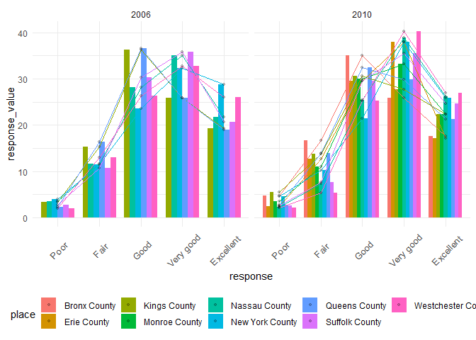

p8105\_hw3\_gx2144
================
Guangling Xu
10/4/2019

## set up

``` r
library(tidyverse)
```

    ## -- Attaching packages ------------------------------------ tidyverse 1.2.1 --

    ## v ggplot2 3.2.1     v purrr   0.3.2
    ## v tibble  2.1.3     v dplyr   0.8.3
    ## v tidyr   1.0.0     v stringr 1.4.0
    ## v readr   1.3.1     v forcats 0.4.0

    ## -- Conflicts --------------------------------------- tidyverse_conflicts() --
    ## x dplyr::filter() masks stats::filter()
    ## x dplyr::lag()    masks stats::lag()

``` r
library(p8105.datasets)
data("instacart")
data("brfss_smart2010")
```

## Problem 1

  - Dataset Discription:

  - There are 15 variables and 1,384,617 columns for each
    variable.Meanings of each variable are listed below:
    
      - order\_id: order identifier, to identify different orders.
      - product\_id: product identifier, to identify different products
        in different aisles.
      - add\_to\_cart\_order: order in which each product was added to
        cart.
      - reordered: 1 if this prodcut has been ordered by this user in
        the past, 0 otherwise.
      - user\_id: customer identifier, to identify different users. In
        this dataset, there are 131,209 unique users.
      - eval\_set: data for use in this class is exclusively from the
        “train” eval\_set.
      - order\_number: the order sequence number for this user (1 =
        first, n = nth).
      - order\_dow: the day of the week on which the order was placed.
      - order\_hour\_of\_day: the hour of the day on which the order was
        placed.
      - days\_since\_prior\_order: days since the last order, capped at
        30, NA if it was the first time being orderd.
      - product\_name: name of the product.
      - aisle\_id: aisle identifier,identify different aisles.
      - department\_id: department identifier, identify different
        aisles.
      - aisle: the name of the aisle.
      - department: the name of the department.

  - Use the 1st row as an example.The first order user:112108 bought was
    Bulgarian yogurt from yogurt aisle(id = 120) of dairy eggs
    department(id = 16). This product has been reorderd after 9 days of
    its last order at the 4th day of the week,10 am. The product id is
    49302 and the order id is 1.

## Format data

``` r
instacart = instacart %>% 
  mutate(
    aisle = as.factor(aisle), 
    order_dow = recode(order_dow, 
                       "0" = "Sunday",
                       "1" = "Monday",
                       "2" = "Tuesday",
                       "3" = "Wedensday",
                       "4" = "Thursday",
                       "5" = "Friday",
                       "6" = "Saturday"),
    order_dow = as.factor(order_dow)
  
         )        
```

## count the aisle

``` r
aislename = instacart %>% 
  select("aisle") %>% 
  distinct()  
nrow(aislename)
```

    ## [1] 134

  - There are 134 aisles here.

<!-- end list -->

``` r
topaisle = instacart %>% 
  group_by(aisle) %>% 
  count( name = "count") %>% 
  arrange(desc(count)) %>% 
  head(n = 5L)  
knitr::kable(topaisle)
```

| aisle                      |  count |
| :------------------------- | -----: |
| fresh vegetables           | 150609 |
| fresh fruits               | 150473 |
| packaged vegetables fruits |  78493 |
| yogurt                     |  55240 |
| packaged cheese            |  41699 |

  - The Top 5 aisles are fresh vegetables, fresh fruits, packaged
    vegetables fruits, yogurt and packaged cheese.

## Number of items in each aisle

``` r
aislenumber = instacart %>% 
  count(aisle, name = "count") %>% 
  arrange(desc(count)) %>% 
  filter(count > 10000) %>% 
  mutate(
    rank = c(1:length(aisle)),
    aisle = fct_reorder(aisle , rank)
        ) 

ggplot(aislenumber,aes(x = rank,y = count, color = aisle))+
  geom_point()+
  labs(
    title = "number of order in each aisle plot",
    x = "rank of aisle ",
    y = "count of aisle"
  )+
  theme(
    legend.text = element_text( size = 7),
    legend.position = "bottom"
    )
```

<!-- -->
Most items ordered from the aisle is fresh vegetables.

``` r
popbaking = instacart %>% 
  filter(aisle == "baking ingredients") %>% 
  select(aisle,product_name) %>% 
  group_by(product_name) %>% 
  count(name = "count") %>% 
  arrange(desc(count)) 
popbaking = popbaking[c(1:3),]
knitr::kable(popbaking)
```

| product\_name     | count |
| :---------------- | ----: |
| Light Brown Sugar |   499 |
| Pure Baking Soda  |   387 |
| Cane Sugar        |   336 |

``` r
popdogfood = instacart %>% 
  filter(aisle == "dog food care") %>% 
  select(aisle,product_name) %>% 
  group_by(product_name) %>% 
  count(name = "count") %>% 
  arrange(desc(count)) 
popdogfood = popdogfood[c(1:3),]
knitr::kable(popdogfood)
```

| product\_name                                 | count |
| :-------------------------------------------- | ----: |
| Snack Sticks Chicken & Rice Recipe Dog Treats |    30 |
| Organix Chicken & Brown Rice Recipe           |    28 |
| Small Dog Biscuits                            |    26 |

``` r
popveg = instacart %>% 
  filter(aisle == "packaged vegetables fruits") %>% 
  select(aisle,product_name) %>% 
  group_by(product_name) %>% 
  count(name = "count") %>% 
  arrange(desc(count)) 
popveg = popveg[c(1:3),]
knitr::kable(popveg)
```

| product\_name        | count |
| :------------------- | ----: |
| Organic Baby Spinach |  9784 |
| Organic Raspberries  |  5546 |
| Organic Blueberries  |  4966 |

  - Three most popular products of baking ingredients aisle are Light
    Brown Sugar, Pure Baking Soda and Cane Sugar whose counts are
    499,387 and 336.
  - Three most popular products of dog food care are Snack Sticks
    Chicken & Rice Recipe Dog Treats, Organix Chicken & Brown Rice
    Recipe and Small Dog Biscuits whose counts are 30,28 and 26.
  - Three most popular products of packaged vegetables fruits are
    Organic Baby Spinach, Organic Raspberries andOrganic Blueberriess
    whose counts are 9784,5546 and 4966.

<!-- end list -->

``` r
meanhour = instacart %>% 
   filter(product_name ==  c("Pink Lady Apples","Coffee Ice Cream")) %>%
   group_by(product_name,order_dow) %>% 
   summarize(
     meanhour = round(mean(order_hour_of_day),digit =2)) %>% 
   pivot_wider(
    names_from = order_dow,
    values_from = meanhour
  )

knitr::kable(meanhour)
```

| product\_name    | Friday | Monday | Saturday | Sunday | Thursday | Tuesday | Wedensday |
| :--------------- | -----: | -----: | -------: | -----: | -------: | ------: | --------: |
| Coffee Ice Cream |  10.33 |  15.00 |    12.35 |  13.22 |    15.17 |   15.33 |     15.40 |
| Pink Lady Apples |  13.87 |  11.68 |    11.56 |  12.25 |    11.91 |   12.00 |     13.94 |

  - For Coffee Ice cream, mean hour of the day at which it has been
    ordered shows that mostly, it was ordered in the afternoon aroud
    3pm.However, on the 5th and 6th day of the week, customers like to
    order around noon.
  - For Pink Lady Apples, mean hour of the day at which it has been
    ordered shows that mostly, it was ordered around lunch time.

## Problem 2

## clean data

``` r
brfss_smart2010 = brfss_smart2010 %>% 
  janitor::clean_names() %>%
  filter(topic == "Overall Health"& 
         response == c("Excellent","Fair","Good","Poor")) %>%    
  arrange(desc(response) ) 
```

    ## Warning in response == c("Excellent", "Fair", "Good", "Poor"): longer
    ## object length is not a multiple of shorter object length

``` r
state2002 = brfss_smart2010 %>%
  select(year,locationabbr,locationdesc) %>% 
  filter(year == "2002") %>% 
  group_by(locationabbr) %>% 
  count(name = "count") %>% 
  filter(count >= 7) %>% 
  arrange(count)
```

  - There are 7 state which were observed at 7 or more locations in
    2002.They were CT,FL,RI,MA,PA,NV,NJ.NC and NJ were observed most, in
    which 10 locations have been observed.

<!-- end list -->

``` r
state2010 = brfss_smart2010 %>%
  select(year,locationabbr,locationdesc) %>% 
  filter(year == "2010") %>% 
  group_by(locationabbr) %>% 
  count(name = "count") %>% 
  filter(count >= 7) %>% 
  arrange(count)
```

  - There are 11 state which were observed at 7 or more locations in
    2002.They were CA,ME,OH,NV,ID,MA,NJ,TX,MD,PA,FL.FL were observed
    most, in which 48 locations have been observed.Compared to 2002,more
    states were observed and more locations were surveyed.And there were
    big differences between the choice of state where the survey was
    conducted.Changes between 2002 and 2010 reflect potential public
    health concerns given by the investigators.

<!-- end list -->

``` r
excellent = brfss_smart2010 %>%
  filter(response == "Excellent") %>% 
  select(year,locationabbr,locationdesc,data_value) %>% 
  group_by(year,locationabbr,locationdesc) %>% 
  summarise(meanvalue =round(mean(data_value),digit =2)) %>% 
  na.omit(meanvalue)  
  
ggplot(excellent,aes(x = year,y = meanvalue,color = locationabbr))+
    geom_point() + geom_line() + 
    theme(legend.position = "right")+       
    scale_y_continuous(breaks = seq(0,40,5))
```

<!-- -->

  - comment:

<!-- end list -->

``` r
NY = brfss_smart2010 %>%
  select(year,data_value,response,locationabbr,locationdesc) %>%
  arrange(year) %>% 
  filter(locationabbr == "NY"
         & (year == c("2006")|year == c("2010")) 
         ) %>% 
  select(-locationabbr)
ggplot(NY,aes(x = response,y = data_value,fill =locationdesc ))+
      geom_point() + 
      geom_line() + 
      geom_bar(stat = "identity" , position = "dodge",width = 0.4)+
      theme(legend.position = "right")+
      ggthemes::theme_excel()+
      scale_y_continuous(breaks = seq(0,30,2))+
      facet_grid(. ~ year)
```

    ## geom_path: Each group consists of only one observation. Do you need to
    ## adjust the group aesthetic?
    ## geom_path: Each group consists of only one observation. Do you need to
    ## adjust the group aesthetic?

<!-- -->

  - comment:

## problem 3

``` r
options(digits=4)

accelerometer = read.csv("./accel_data.csv") %>% 
  na.omit() %>% 
  mutate(
    dayorweekends = recode(day,
      Friday = "weekdays",
      Thursday = "weekdays",
      Wednesday = "weekdays",
      Tuesday = "weekdays",
      Monday = "weekdays",
      Saturday = "weekdend",
      Sunday = "weekdend")
    ) %>% 
  select(dayorweekends,everything()) %>% 
  pivot_longer(
    activity.1:activity.1440,
    names_to = "activity",
    values_to = "activity count"
    
  )
```

  - Descirption: In this chart, column names are
    dayorweekends,week,day\_id,day,activity and activity count.
    “dayorweekends” denotes whether the day is weekday or
    weekends;“week” denotes the nth week of the activity’“day\_id”
    denotes the order of the day;“activity” denotes the time of the
    record in a day;“activity count” denotes the count of each activity.
    Each day, there are 24\*60 =1440 times of activity records and this
    record last for 5 weeks,equals to 35 days. So the sum of the
    acitivity counts is 50400, which is the same as the row number here.

<!-- end list -->

``` r
meanday = accelerometer %>% 
  group_by(day_id ) %>% 
  summarize(
    total = sum(`activity count`)
    )

knitr::kable(meanday)
```

| day\_id |  total |
| ------: | -----: |
|       1 | 480543 |
|       2 |  78828 |
|       3 | 376254 |
|       4 | 631105 |
|       5 | 355924 |
|       6 | 307094 |
|       7 | 340115 |
|       8 | 568839 |
|       9 | 295431 |
|      10 | 607175 |
|      11 | 422018 |
|      12 | 474048 |
|      13 | 423245 |
|      14 | 440962 |
|      15 | 467420 |
|      16 | 685910 |
|      17 | 382928 |
|      18 | 467052 |
|      19 | 371230 |
|      20 | 381507 |
|      21 | 468869 |
|      22 | 154049 |
|      23 | 409450 |
|      24 |   1440 |
|      25 | 260617 |
|      26 | 340291 |
|      27 | 319568 |
|      28 | 434460 |
|      29 | 620860 |
|      30 | 389080 |
|      31 |   1440 |
|      32 | 138421 |
|      33 | 549658 |
|      34 | 367824 |
|      35 | 445366 |

  - Based on the data, we can see that the sum of the activity count of
    a day periodically fluctuates.Once the sum is high, it goes down for
    a couple of days and then rises up again.

<!-- end list -->

``` r
hourcourse = accelerometer %>% 
  group_by(day_id,day) %>% 
  summarize(
    total = sum(`activity count`)
) %>% 
ggplot(aes(x = day_id,y = total))+
  geom_point()+
  geom_line(stat = "identity" ,aes(color = day))
hourcourse
```

<!-- -->

  - When we look at the smooth of the data, the trend goes like a curve.
    Overall, as days gone by, total activity count rised first and then
    decreased, then rised up or keep parallel to the x axis in the end.
    Among 7 days of week, Sunday and Saturday have unique curves which
    keep on decreasing over the days. This may imply that this patient
    used to relax and keep sedentary during weekends.
