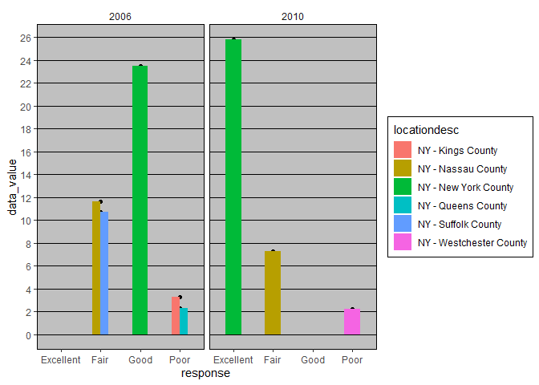
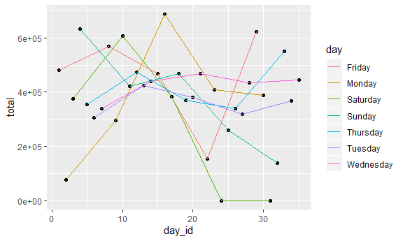

p8105\_hw3\_gx2144
================
Guangling Xu
10/4/2019

## set up

``` r
library(tidyverse)
```

    ## -- Attaching packages --------------------------------- tidyverse 1.2.1 --

    ## v ggplot2 3.2.1     v purrr   0.3.2
    ## v tibble  2.1.3     v dplyr   0.8.3
    ## v tidyr   1.0.0     v stringr 1.4.0
    ## v readr   1.3.1     v forcats 0.4.0

    ## -- Conflicts ------------------------------------ tidyverse_conflicts() --
    ## x dplyr::filter() masks stats::filter()
    ## x dplyr::lag()    masks stats::lag()

``` r
library(p8105.datasets)
data("instacart")
data("brfss_smart2010")
```

## ggplot set

``` r
knitr::opts_chunk$set(
  fig.width = 6,
  fig.asp = .6,
  out.width = "90%"
)
```

## Problem 1

``` r
aislename = instacart %>% 
  select("aisle") %>% 
  distinct()  
nrow(aislename)
```

    ## [1] 134

There are 134 aisles here.

``` r
mostorder = instacart %>%
  group_by(aisle) %>%
  count( name = "count") %>% 
  arrange(desc(count)) %>% 
  filter(count >= 10000)   
ggplot(mostorder,aes(x = aisle,y = count))+
  geom_point()+
  theme(
    axis.text.x = element_text(angle = 90, hjust = 0.5,
    vjust = 0.5))+
  ylim(5000,160000)
```


Most items ordered from the aisle is fresh vegetables.

``` r
popbaking = instacart %>% 
  filter(aisle == "baking ingredients") %>% 
  select(aisle,product_name) %>% 
  group_by(product_name) %>% 
  count(name = "count") %>% 
  arrange(desc(count)) 
popbaking = popbaking[c(1:3),]
knitr::kable(popbaking)
```

| product\_name     | count |
| :---------------- | ----: |
| Light Brown Sugar |   499 |
| Pure Baking Soda  |   387 |
| Cane Sugar        |   336 |

``` r
popdogfood = instacart %>% 
  filter(aisle == "dog food care") %>% 
  select(aisle,product_name) %>% 
  group_by(product_name) %>% 
  count(name = "count") %>% 
  arrange(desc(count)) 
popdogfood = popdogfood[c(1:3),]
knitr::kable(popdogfood)
```

| product\_name                                 | count |
| :-------------------------------------------- | ----: |
| Snack Sticks Chicken & Rice Recipe Dog Treats |    30 |
| Organix Chicken & Brown Rice Recipe           |    28 |
| Small Dog Biscuits                            |    26 |

``` r
popveg = instacart %>% 
  filter(aisle == "packaged vegetables fruits") %>% 
  select(aisle,product_name) %>% 
  group_by(product_name) %>% 
  count(name = "count") %>% 
  arrange(desc(count)) 
popveg = popveg[c(1:3),]
knitr::kable(popveg)
```

| product\_name        | count |
| :------------------- | ----: |
| Organic Baby Spinach |  9784 |
| Organic Raspberries  |  5546 |
| Organic Blueberries  |  4966 |

``` r
meanhour = instacart %>% 
   filter(product_name ==  c("Pink Lady Apples","Coffee Ice Cream")) %>%
   group_by(product_name,order_dow) %>% 
   summarize(
     meanhour = round(mean(order_hour_of_day),digit =2)) %>% 
   pivot_wider(
    names_from = order_dow,
    values_from = meanhour
  )
```

    ## Warning in product_name == c("Pink Lady Apples", "Coffee Ice Cream"):
    ## longer object length is not a multiple of shorter object length

``` r
knitr::kable(meanhour)
```

| product\_name    |     0 |     1 |     2 |     3 |     4 |     5 |     6 |
| :--------------- | ----: | ----: | ----: | ----: | ----: | ----: | ----: |
| Coffee Ice Cream | 13.22 | 15.00 | 15.33 | 15.40 | 15.17 | 10.33 | 12.35 |
| Pink Lady Apples | 12.25 | 11.68 | 12.00 | 13.94 | 11.91 | 13.87 | 11.56 |

\#\# Problem 2 \#\# clean data

``` r
brfss_smart2010 = brfss_smart2010 %>% 
  janitor::clean_names() %>%
  filter(topic == "Overall Health"& 
         response == c("Excellent","Fair","Good","Poor")) %>%    
  arrange(desc(response) ) 
```

    ## Warning in response == c("Excellent", "Fair", "Good", "Poor"): longer
    ## object length is not a multiple of shorter object length

``` r
state2002 = brfss_smart2010 %>%
  select(year,locationabbr,locationdesc) %>% 
  filter(year == "2002") %>% 
  group_by(locationabbr) %>% 
  count(name = "count") %>% 
  filter(count >= 7) %>% 
  arrange(count)
```

\*\*There are 7 state which were observed at 7 or more locations in
2002.They were CT,FL,RI,MA,PA,NV,NJ.NC and NJ were observed most, in
which 10 locations have been observed.

``` r
state2010 = brfss_smart2010 %>%
  select(year,locationabbr,locationdesc) %>% 
  filter(year == "2010") %>% 
  group_by(locationabbr) %>% 
  count(name = "count") %>% 
  filter(count >= 7) %>% 
  arrange(count)
```

\*\*There are 11 state which were observed at 7 or more locations in
2002.They were CA,ME,OH,NV,ID,MA,NJ,TX,MD,PA,FL.FL were observed most,
in which 48 locations have been observed.Compared to 2002,more states
were observed and more locations were surveyed.And there were big
differences between the choice of state where the survey was
conducted.Changes between 2002 and 2010 reflect potential public health
concerns given by the investigators.

``` r
excellent = brfss_smart2010 %>%
  filter(response == "Excellent") %>% 
  select(year,locationabbr,locationdesc,data_value) %>% 
  group_by(year,locationabbr,locationdesc) %>% 
  summarise(meanvalue =round(mean(data_value),digit =2)) %>% 
  na.omit(meanvalue)  
  
ggplot(excellent,aes(x = year,y = meanvalue,color = locationabbr))+
    geom_point() + geom_line() + 
    theme(legend.position = "right")+       
    scale_y_continuous(breaks = seq(0,40,5))
```


\*\* comment:

``` r
NY = brfss_smart2010 %>%
  select(year,data_value,response,locationabbr,locationdesc) %>%
  arrange(year) %>% 
  filter(locationabbr == "NY"
         & (year == c("2006")|year == c("2010")) 
         ) %>% 
  select(-locationabbr)
ggplot(NY,aes(x = response,y = data_value,fill =locationdesc ))+
      geom_point() + 
      geom_line() + 
      geom_bar(stat = "identity" , position = "dodge",width = 0.4)+
      theme(legend.position = "right")+
      ggthemes::theme_excel()+
      scale_y_continuous(breaks = seq(0,30,2))+
      facet_grid(. ~ year)
```

    ## geom_path: Each group consists of only one observation. Do you need to
    ## adjust the group aesthetic?
    ## geom_path: Each group consists of only one observation. Do you need to
    ## adjust the group aesthetic?


\*\* comment:

## problem 3

``` r
options(digits=4)

accelerometer = read.csv("./accel_data.csv") %>% 
  na.omit() %>% 
  mutate(
    dayorweekends = recode(day,
      Friday = "weekdays",
      Thursday = "weekdays",
      Wednesday = "weekdays",
      Tuesday = "weekdays",
      Monday = "weekdays",
      Saturday = "weekdend",
      Sunday = "weekdend")
    ) %>% 
  select(dayorweekends,everything()) %>% 
  pivot_longer(
    activity.1:activity.1440,
    names_to = "activity",
    values_to = "avtivity count"
    
  )
```

\*\* Descirption: In this chart, column names are
dayorweekends,week,day\_id,day,activity and activity count.
“dayorweekends” denotes whether the day is weekday or weekends;“week”
denotes the nth week of the activity’“day\_id” denotes the order of the
day;“activity” denotes the time of the record in a day;“activity count”
denotes the count of each activity. Each day, there are 24\*60 =1440
times of activity records and this record last for 5 weeks,equals to 35
days. So the sum of the acitivity counts is 50400, which is the same as
the row number here.

``` r
day1 = accelerometer %>% 
  filter(day_id == 1)
sum1 = sum(pull(day1,"avtivity count"))

day2 = accelerometer %>% 
  filter(day_id == 2) 
sum2 = sum(pull(day2,"avtivity count"))

day3 = accelerometer %>% 
  filter(day_id == 3) 
sum3 = sum(pull(day3,"avtivity count"))

day4 = accelerometer %>% 
  filter(day_id == 4) 
sum4 = sum(pull(day4,"avtivity count"))

day5 = accelerometer %>% 
  filter(day_id == 5) 
sum5 = sum(pull(day5,"avtivity count"))

day6 = accelerometer %>% 
  filter(day_id == 6) 
sum6 = sum(pull(day6,"avtivity count"))

day7 = accelerometer %>% 
  filter(day_id == 7) 
sum7 = sum(pull(day7,"avtivity count"))

day8 = accelerometer %>% 
  filter(day_id == 8) 
sum8 = sum(pull(day8,"avtivity count"))

day9 = accelerometer %>% 
  filter(day_id == 9) 
sum9 = sum(pull(day9,"avtivity count"))

day10 = accelerometer %>% 
  filter(day_id == 10) 
sum10 = sum(pull(day10,"avtivity count"))

day11 = accelerometer %>% 
  filter(day_id == 11) 
sum11 = sum(pull(day11,"avtivity count"))

day12 = accelerometer %>% 
  filter(day_id == 12) 
sum12 = sum(pull(day12,"avtivity count"))

day13 = accelerometer %>% 
  filter(day_id == 13) 
sum13 = sum(pull(day13,"avtivity count"))

day14 = accelerometer %>% 
  filter(day_id == 14) 
sum14 = sum(pull(day14,"avtivity count"))

day15 = accelerometer %>% 
  filter(day_id == 15) 
sum15 = sum(pull(day15,"avtivity count"))

day16 = accelerometer %>% 
  filter(day_id == 16) 
sum16 = sum(pull(day16,"avtivity count"))

day17 = accelerometer %>% 
  filter(day_id == 17) 
sum17 = sum(pull(day17,"avtivity count"))

day18 = accelerometer %>% 
  filter(day_id == 18) 
sum18 = sum(pull(day18,"avtivity count"))

day19 = accelerometer %>% 
  filter(day_id == 19) 
sum19 = sum(pull(day19,"avtivity count"))

day20 = accelerometer %>% 
  filter(day_id == 20) 
sum20 = sum(pull(day20,"avtivity count"))

day21 = accelerometer %>% 
  filter(day_id == 21) 
sum21 = sum(pull(day21,"avtivity count"))

day22 = accelerometer %>% 
  filter(day_id == 22) 
sum22 = sum(pull(day22,"avtivity count"))

day23 = accelerometer %>% 
  filter(day_id == 23) 
sum23 = sum(pull(day23,"avtivity count"))

day24 = accelerometer %>% 
  filter(day_id == 24) 
sum24 = sum(pull(day24,"avtivity count"))

day25 = accelerometer %>% 
  filter(day_id == 25) 
sum25 = sum(pull(day25,"avtivity count"))

day26 = accelerometer %>% 
  filter(day_id == 26) 
sum26 = sum(pull(day26,"avtivity count"))

day27 = accelerometer %>% 
  filter(day_id == 27) 
sum27 = sum(pull(day27,"avtivity count"))

day28 = accelerometer %>% 
  filter(day_id == 28) 
sum28 = sum(pull(day28,"avtivity count"))

day29 = accelerometer %>% 
  filter(day_id == 29) 
sum29 = sum(pull(day29,"avtivity count"))

day30 = accelerometer %>% 
  filter(day_id == 30) 
sum30 = sum(pull(day30,"avtivity count"))

day31 = accelerometer %>% 
  filter(day_id == 31) 
sum31 = sum(pull(day31,"avtivity count"))

day32 = accelerometer %>% 
  filter(day_id == 32) 
sum32 = sum(pull(day32,"avtivity count"))

day33 = accelerometer %>% 
  filter(day_id == 33) 
sum33 = sum(pull(day33,"avtivity count"))

day34 = accelerometer %>% 
  filter(day_id == 34) 
sum34 = sum(pull(day34,"avtivity count"))

day35 = accelerometer %>% 
  filter(day_id == 35) 
sum35 = sum(pull(day35,"avtivity count"))

total = data.frame(day = c(1,2,3,4,5,6,7,8,9,10,11,12,13,14,15,16,17,18,19,20,21,22,23,24,25,26,27,28,29,30,31,32,33,34,35),
                  sum =    c(sum1,sum2,sum3,sum4,sum5,sum6,sum7,sum8,sum9,sum10,sum11,sum12,sum13,sum14,sum15,sum16,sum17,sum18,sum19,sum20,sum21,sum22,sum23,sum24,sum25,sum26,sum27,sum28,sum29,sum30,sum31,sum32,sum33,sum34,sum35)
                   )

knitr::kable(total)
```

|      day |                                                                                                                                                                            sum |
| -------: | -----------------------------------------------------------------------------------------------------------------------------------------------------------------------------: |
|        1 |                                                                                                                                                                         480543 |
|        2 |                                                                                                                                                                          78828 |
|        3 |                                                                                                                                                                         376254 |
|        4 |                                                                                                                                                                         631105 |
|        5 |                                                                                                                                                                         355924 |
|        6 |                                                                                                                                                                         307094 |
|        7 |                                                                                                                                                                         340115 |
|        8 |                                                                                                                                                                         568839 |
|        9 |                                                                                                                                                                         295431 |
|       10 |                                                                                                                                                                         607175 |
|       11 |                                                                                                                                                                         422018 |
|       12 |                                                                                                                                                                         474048 |
|       13 |                                                                                                                                                                         423245 |
|       14 |                                                                                                                                                                         440962 |
|       15 |                                                                                                                                                                         467420 |
|       16 |                                                                                                                                                                         685910 |
|       17 |                                                                                                                                                                         382928 |
|       18 |                                                                                                                                                                         467052 |
|       19 |                                                                                                                                                                         371230 |
|       20 |                                                                                                                                                                         381507 |
|       21 |                                                                                                                                                                         468869 |
|       22 |                                                                                                                                                                         154049 |
|       23 |                                                                                                                                                                         409450 |
|       24 |                                                                                                                                                                           1440 |
|       25 |                                                                                                                                                                         260617 |
|       26 |                                                                                                                                                                         340291 |
|       27 |                                                                                                                                                                         319568 |
|       28 |                                                                                                                                                                         434460 |
|       29 |                                                                                                                                                                         620860 |
|       30 |                                                                                                                                                                         389080 |
|       31 |                                                                                                                                                                           1440 |
|       32 |                                                                                                                                                                         138421 |
|       33 |                                                                                                                                                                         549658 |
|       34 |                                                                                                                                                                         367824 |
|       35 |                                                                                                                                                                         445366 |
| \*\*Base | d on the data, we can see that the sum of the activity count of a day periodically fluctuates.Once the sum is high, it goes down for a couple of days and then rises up again. |

``` r
total = total %>% 
  mutate(
    week = c(rep(1,7),rep(2,7),rep(3,7),rep(4,7),rep(5,7))
  )
ggplot(total,aes(x = day,y = sum,fill = week))+
  geom_point()+
  geom_bar(stat = "identity" , position = "dodge",width = 0.4)+
  geom_smooth()
```

    ## `geom_smooth()` using method = 'loess' and formula 'y ~ x'


\*When we look at the smooth of the data, the trend goes like a curve.
In the first 14 days, the sum of activity count rises up and in the next
10 days, the sum of activity count goes down. Then, the trend goes up
again.
